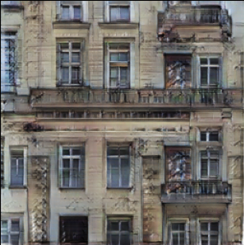

# wrofacade

This is the Wrofacade project's repository - Historic facades generation with AI, accepting user requirements.




---

**See the [project homepage](https://tenements-facades-project.github.io/wrofacade/)**

## About the project

The project goal was to develop an Aritifical Intelligence-based program which could assist architects in their work by fast generating a big number of tenements’ facades concepts (in the form of realistic images). The application should be capable of taking into account the requirements passed by the user.

The requirements on output facades can be divided into two categories:

- **technical (hard) requirements** (e.g. facade's width and height,
number of floors)
- **style (soft) requirements** (e.g. historical style compliance, mood)

## System's concept


Style requirements are not supported at this moment. They are planned to be introduced in the translation step.

## Supported pipelines

This repository provides several pipelines for image generation. The choice of the pipeline
depends on the needs of the user - different pipelines are capable of meeting different requirements.

The **primary pipeline** developed in this project is (mask generator + mask to image translator).
This pipeline is represented by the class `SegmentAndTranslate`
(`src.facade_generator.pipeline.SegmentAndTranslate`). An object of this class contains
two objects: a segmentation mask generator and a mask to image translator.
Segmentation mask generator can be a grammar-based generator (class `src.segmask.grammars.GrammarMaskGenerator`)
or a segmentation model that accepts a facade image (class `src.segmask.transformers_seg.TransSegmentationHF`).

This project provides also **additional pipelines**:

- pure grammars - in this option, images are generated using
just grammars (i.e., we use grammar not to generate segmentation mask but a ready facade image).
This pipeline is implemented by the class
`src.facade_generator.pure_grammars_generator.PureGrammarGenerator`.
- GANs - there is also a pipeline consisting of just one GAN network; it is implemented by
the class `src.facade_generator.gan_generator.GANGeneratorTorch` (we used StackGAN in our experiments)

## Project structure

```
wrofacade
├── docs
├── notebooks
│   ├── 1-generated-images-examples.ipynb
│   └── 2-useful-utilities.ipynb
├── label2clr.json
├── README.md
├── requirements.txt
├── scripts
│   ├── train_grammar_from_grammars.py
│   └── train_grammar_from_images.py
├── src
│   ├── config
│   ├── facade_generator
│   ├── imgtrans
│   ├── segmask
│   ├── utils
│   └── visualize
```

- All source code necessary in the generation process is situated in the `src` directory.
- In the `scripts` directory, there are scripts to prepare generation tools
  (currently, there are only scripts to train a generative grammar)
- `docs` contains website content and images used in this README
- `notebooks` provides some Jupyter notebooks with examples of usage utilities from
  this repository
- `label2clr.json` file contains mapping from class names to pixel labels used in
segmentation masks

**Subdirectories of `src`**:

- `config`: place when configuration is stored and the code to access it
- `facade_generator`: fundamental logic of pipelines is defined here
- `imgtrans`: image translators are implemented here
- `segmask`: in this directory, one can find all models providing segmentation masks
  of facades
- `utils`: here is the implementation of utilities necessary to run pipelines
  (e.g. grammar algorithms)
- `visualize`: some utils for visualization

## How to run

The procedure of running code from this repository is a little bit complex and depends
on the pipeline you would like to use, because you will have to obtain all necessary
models. First, the procedures of obtaining components of pipeline are presented.
You do not have to follow all the procedures, but just these providing components of
your pipeline. For example, if you want to use `SegmentAndTranslate` with grammars,
you just need have Pix2Pix model trained and generative grammar built.

#### Set up environment

Navigate to the project's root directory, and install packages:

```commandline
pip install -r requirements.txt
```

#### Inducing (building) generative grammar

You will need some facades dataset (images and segmentation masks).
Build two empty directories and place facades images in one directory and facades
mask in the other. A facade's image and its mask files should have the same name
(for example, if images are stored in `imgs/` and masks in `masks/`, then if a facade's
image path is `imgs/facade_x.png`, then its mask should be `masks/facade/x.png`).

Run script inducing a generative grammar from images and masks:

```bash
PYTHONPATH=$(pwd) python3 scripts/train_grammar_from_images.py \
  <imgs_dir> <masks_dir> <output_dir> \
  --window_labels <labels> --background_label <label> --n_epochs <number_of_epochs>
```

for example:

```bash
PYTHONPATH=$(pwd) python3 scripts/train_grammar_from_images.py \
  imgs masks output \
  --window_labels 2 4 --background_label 0 --n_epochs 200
```

This script results in saving pickled grammars:

- every some number of epochs: checkpoint in checkpoints directory
- after all epochs: final grammar

Unfortunately, this implementation of grammars learning is not very fast, so training
for large number of facades takes prohibitively long (we leave optimizing the implementation,
e.g. utilizing Numba, for future work).

You can train several grammars on different small sets of images and then merge
them and train as one grammar for a few epochs. This can be done by running the script:

```bash
PYTHONPATH=$(pwd) python3 scripts/train_grammar_from_grammars.py \
  <imgs_dir> <mask_dir> <input_grammars_dir> <output_dir> \
  --window_labels <labels> --background_label <label> --n_epochs <number_of_epochs>
```

#### Segmentation model

If you wish to use `TransSegmentationHF` class or write your own that derives segmentation
mask from a given facade image, you will need a segmentation model. Unfortunately,
the model we used is not publicly available. You will have to modify the `model_name_or_path`
property in the `segmentator` part of config.yaml file (`src/config/config.yaml`) to
the path to your model.

#### Pix2Pix

In order to train the Pix2Pix model, you can follow steps described in the
[original repo](https://github.com/junyanz/pytorch-CycleGAN-and-pix2pix).
You will need the state dict file: `"<epoch>_net_<name>.pth"`.

#### Run a pipeline

1. Open the configuration file: `src/config/config.yaml` and set correct paths to
files with your models
2. Modify `label2clr.json` so that it complies with your dataset
3. Run Python in such a way that it can import `src`, e.g.:

```bash
PYTHONPATH=$(pwd) python3
```

Then, you can import utilities from `src`, create an object of a class that implements
desired pipeline, and generate facade images.

#### Run notebooks

If you want to run examples in notebooks, just run:

```bash
PYTHONPATH=$(pwd) jupyter lab
```

and navigate to the notebook you would like to run.

## Limitations and future work

- Making the mask-to-image translator accept style requirements
- Code for inducing grammars is very slow; it can be improved by
reimplementing the algorithm - using Numba or moving to a faster programming language
- In the pipeline we built, the Pix2Pix model always returns square results
- Due to the fact that our algorithm for parsing input facades is imperfect, the grammar model
makes mistakes in terms of number of floors of generated facade

Any contribution is welcome!

## References

[1] Martinovic, Andelo, and Luc Van Gool. "Bayesian grammar learning for inverse procedural modeling."
Proceedings of the IEEE Conference on Computer Vision and Pattern Recognition. 2013.
https://openaccess.thecvf.com/content_cvpr_2013/html/Martinovic_Bayesian_Grammar_Learning_2013_CVPR_paper.html

[2] Riemenschneider, Hayko, et al. "Irregular lattices for complex shape grammar facade parsing."
2012 IEEE conference on computer vision and pattern recognition. IEEE, 2012.

[3] Martinovic, Andelo, and Luc Van Gool. Earley parsing for 2D stochastic context free grammars.
Technical Report KUL/ESAT/PSI/1301, KU Leuven, 2013. 4, 2013.
https://lirias.kuleuven.be/retrieve/224195

[4] Isola, Phillip, Jun-Yan Zhu, Tinghui Zhou, and Alexei A. Efros. 2016. “Image-to-Image Translation with Conditional Adversarial Networks.” 2017 IEEE Conference on Computer Vision and Pattern Recognition (CVPR), Honolulu, HI, USA, 2017, pp. 5967-5976, https://doi.org/10.1109/CVPR.2017.632

[5] [pix2pix repository](https://github.com/phillipi/pix2pix),

[6] [pytorch-CycleGAN-and-pix2pix repository](https://github.com/junyanz/pytorch-CycleGAN-and-pix2pix)
