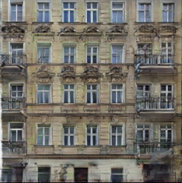
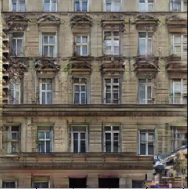
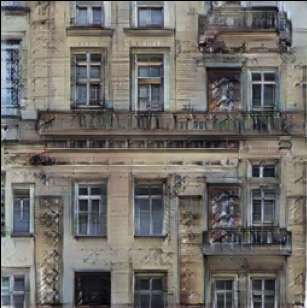
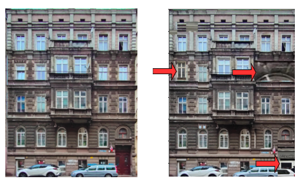
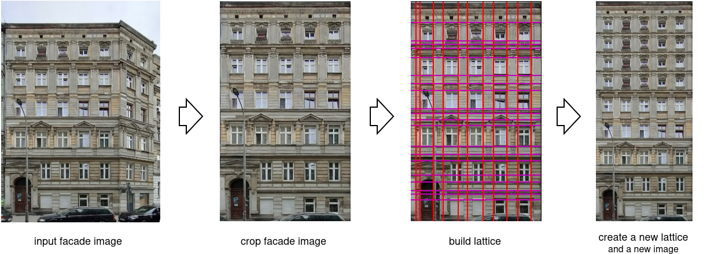

---

---
# Results examples

### Grammar + Pix2Pix

Here are some examples of generated images using pipeline, in which
generative grammar generates a segmentation mask and Pix2Pix transaltes
it to a new image.

### Pure grammar generation

We also tried to generate new images just with generative grammar.
We noticed that generated images in this way typically are very similar
to an image from the training data, but with some parts inserted from
other training images. An example is shown below

_On the left - a real photo from training data, on the right - an image
generated with grammars, with differences marked with arrows_

### Lattices

In wrofacade, we developed a useful utility for convenient manipulation of
facade images - _lattices_. Using lattices, you can remove big background regions from a facade image (crop the facade), quickly extract parts of facades (e.g. desired floors), get the segmentation mask major vote for each cell, or even create new facade images.

_Exemplary pipeline utilizing lattices_

