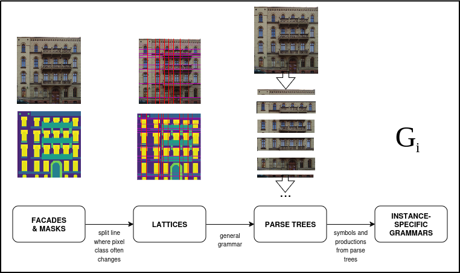

---

---
# Technology specification

Here You can learn about AI technologies used to generate facades with Wrofacade.

## Split grammar learning

The process of inducing a generative split grammar is inspired with [1],
In this approach, we assume that structure of a facade can be modelled with
a formal grammar.

A facade's grammar represents hierarchical structure of the facade. Formally,
a (split) grammar consists of a set of terminals (representing basic parts of
a facade, e.g. a door or a window), a set of nonterminals (each facade's fragment
composed of several terminals is a nonterminal, e.g. an entire floor) and a set of productions.
A production is a function accepting one nonterminal and returning a set
of nonterminals or terminals (a production _splits_ nonterminal into terminals
or nonterminals at lower level). If a grammar describes well the hierarchical structure
of a facade, we say that the facade is the result of _a production_ of the grammar.

We can design a grammar in which some (or all) nonterminals can be split in
more than one way (i.e. exists more than one production applicable to a nonterminal).
Such a grammar is called a _nondeterministic grammar_. If for each nonterminal,
each rule applicable is assigned a probability of being chosen in a production,
then a _stochastic grammar_ is obtained. Notice that in such a grammar, nonterminals
are no longer represented with _one concrete part of a facade_, but the are rather
abstract (for instance, if one has a nonterminal representing a ground floor,
it can take various forms in the result facade, which depends on which production
rule is chosen in a production to split it and to produce further nonterminals or
terminals). Additionally, such a grammar is a _generative model_, that may be used
to generate facade's images examples.

Given a set of facades' images, the idea is to build a stochastic grammar in which
terminals and nonterminals are derived from the input examples, but the grammar
is able to generate new facades examples using them.

### Grammar learning process

The input to the process is a set of facades examples, where each example
is a pair of images: (_I_, _M_); _I_ is a RGB image of a facade, and
_M_ is the segmentation mask of the facade.

The learning pipeline is as follows:

1. For each input example, build a lattice (i.e. represent the image and mask
as a grid of rectangles of different dimensions).
2. For each lattice, create a parse tree (in this project, the tool for obtaining
a parse tree from a lattice is called a _general grammar_).
3. For each parse tree, create a grammar (each leaf in the parse tree is
a terminal, and each other node in the parse tree is a nonterminal); each such a grammar
is referred to as an _instance-specific grammar_, because each one is deterministic
and produces just one input example.
4. Merge all instance-specific grammars into one grammar (which just produces
input examples with equal probabilities).
5. Iteratively perform _nonterminals merging_ - in this process, two nonterminals are chosen
and merged into _one nonterminal_, such that the grammar has a lower number of nonterminals
(is "more stochastic") with as high likelihood on input examples as possible.

_Grammar learning pipeline - part 1_

_Grammar learning pipeline - part 2_

### Lattices creation

To create a rectangular lattice for a facade, the facade's segmentation mask is used.
A set of horizontal and vertical split lines is obtained by finding pixel coordinates
where there is the biggest number of changes of pixels' classes in the segmentation mask
(this idea is based on [2]).
After that, DBSCAN clustering is applied on split lines' coordinates to remove redundant
lines (_denoising_ of split lines).

### Obtaining parse trees with general grammar

For each lattice, general grammar is used to create a parse tree. A parse tree should
break down a facade in a logical way (i.e. facade into floors, then floors into cells with windows
etc.). This is achieved by identifying windows in the image with utilization of the
segmentation mask.

### Obtaining merged grammar

Once parse trees of examples are created, they are conversed into instance-specific grammars.
Then, all instance-sepcific grammars are merged into one stochastic grammar, the only stochastic
production of which is the choice of an input example to generate. The merged grammar genereates
input facades, and probability of generating each facade is 1/_N_, where _N_ is the number of
input facades examples.

### Nonterminals merging

The nonterminals merging procedure is as follows:

1. Repeat:
2.     choose a random nonterminal _X_
3.     choose randomly a set of other nonterminals _S_ that are similar to _X_
4.     for each nonterminal _Y_ from _S_
5.         create new grammar, with merged _X_ and _Y_
6.         calculate likelihood of the new grammar on input facades
7.     replace grammar with a new grammar, with merged _X_ and the nonterminal from _S_ with the greatest likelihood

How to calculate the likelihood of a grammar on a set of input facades' images? The likelihood of an input
example is the sum of probabilities of all parse trees that produce the example and can be produced with
the grammar (technically, we use logarithms and calculate the loglikelihood). All parse trees of a facade
that a grammar can produces are obtained with 2D Earley Parser (introduced by [3]).

## Image translation

A generated segmentation mask of a facade is translated to a realistic picture using the Pix2Pix model described in detail in [4]. The model consists of two neural networks: a generator, whose task is to generate new images, and a discriminator, which classifies whether the generated image is real or fake. The generator learns the underlying connections between images from the two domains (segmentation masks and façade images), and the discriminator examines each fragment of the generated picture and attempts to classify the patch as authentic or artificial.

### References

[1] Martinovic, Andelo, and Luc Van Gool. "Bayesian grammar learning for inverse procedural modeling."
Proceedings of the IEEE Conference on Computer Vision and Pattern Recognition. 2013.
https://openaccess.thecvf.com/content_cvpr_2013/html/Martinovic_Bayesian_Grammar_Learning_2013_CVPR_paper.html

[2] Riemenschneider, Hayko, et al. "Irregular lattices for complex shape grammar facade parsing."
2012 IEEE conference on computer vision and pattern recognition. IEEE, 2012.

[3] Martinovic, Andelo, and Luc Van Gool. Earley parsing for 2D stochastic context free grammars.
Technical Report KUL/ESAT/PSI/1301, KU Leuven, 2013. 4, 2013.
https://lirias.kuleuven.be/retrieve/224195

[4] Isola, Phillip, Jun-Yan Zhu, Tinghui Zhou, and Alexei A. Efros. 2016. “Image-to-Image Translation with Conditional Adversarial Networks.” 2017 IEEE Conference on Computer Vision and Pattern Recognition (CVPR), Honolulu, HI, USA, 2017, pp. 5967-5976, https://doi.org/10.1109/CVPR.2017.632

